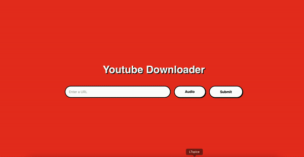

# YouTube-Downloader

## Description

This is a simple YouTube downloader that allows you to download videos and audio from YouTube.

## Requirements

- [Python](https://www.python.org)
- [PHP](https://www.php.net)
- [Pytube](https://pytube.io/)

## Files explanation

The files of the project are in the files folder.

- **index.php**: This is the front-end of the project. It contains the form that allows you to download the video or audio. It uses javascript to validate the form and navigate through the download process.

- **index.css**: This is the css file of the project. It contains the styles of the front-end.

- **download.php**: This is the back-end of the project. It contains the code that allows you to download the video or audio. It send the data to the python script and then it returns the file to the user. This file is wake up by the index.php file when the user submits the form.

- **main.py**: This is the python script that allows you to download the video or audio. It uses the pytube library to download the video or audio.

- **cron.py**: This is the file that allows you to delete the files that are older than 1 hour. It must be executed every hour.

- download: This is the folder where the files are downloaded. The cron.py file deletes the files that are older than 1 hour in this folder.

